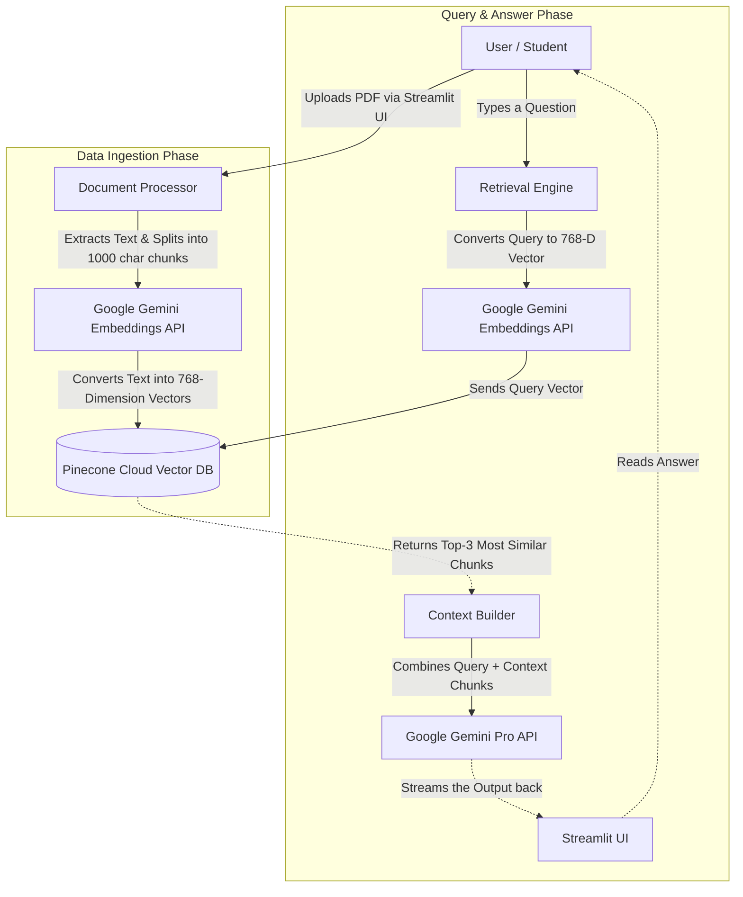

# 🏛️ 1. Complete Architecture Flow (Cloud-Native RAG)

Yeh document tumhe exactly samjhayega ki tumhari app ka architecture actually kaise flow hota hai, taaki interview mein white-boarding karte waqt ya explain karte waqt koi galti na ho.

## The High-Level Flow Diagram

Interview mein tumhe manually yeh diagram explain karna aana chahiye.

## Step-by-Step Breakdown (How it works under the hood)

### 1. Document Ingestion (Jab user PDF upload karta hai)
- **Extraction:** Backend PDF se raw text read karta hai.
- **Chunking:** Kyunki LLM puri 100 pages ki PDF ek baar mein nahi padh sakta (Context window limit aur cost issues), hum text ko chote chote paragraphs (chunks) mein tod dete hain. 
- **Embeddings:** In chunks ko Google Gemini ke embedding model ko bheja jata hai. Embedding model har chunk ko ek array of numbers (vector) mein convert kar deta hai (768 numbers ki list). Yeh numbers us text ka *meaning* capture karte hain.
- **Storage:** Pinecone (Vector Database) in vectors ko save kar leta hai. (Note: Hum original text bhi vector ke saath as metadata save karte hain).

### 2. Retrieval (Jab user sawal poochta hai)
- Agar user poochta hai: *"What is Newton's second law?"*, toh sabse pehle is question ka bhi Vector (embedding) banaya jata hai usi Google API se.
- **Semantic Search:** Ab Pinecone database mein check kiya jata hai ki is question ke vector se sabse zyada closely match karne wale (Cosine Similarity) top 3 document chunks kaunse hain. Cosine Similarity angle measure karti hai vectors ke beech.
- Pinecone un top 3 chunks ka raw text return kar deta hai.

### 3. Generation (Answer ban-na)
- Backend ek **System Prompt** banata hai: *"You are an AI Tutor. Use the provided context to answer the question..."*
- Is prompt ke neeche hum woh Top 3 chunks chipka dete hain (as Context).
- Aur sabse end mein User ka exact Question daal dete hain.
- Yeh poora bada sa prompt Google Gemini Pro LLM ko bheja jata hai.
- LLM us context ko padh ke ek accurate, non-hallucinated answer generate karke Streamlit pe stream kar deta hai.
